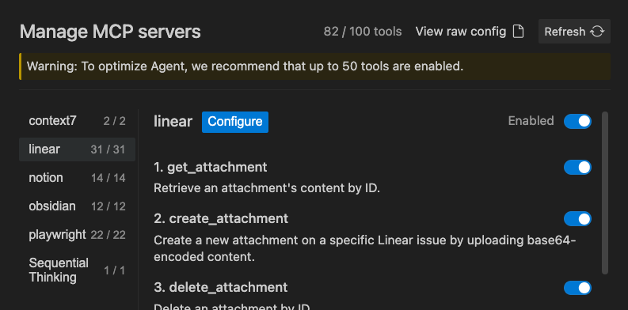
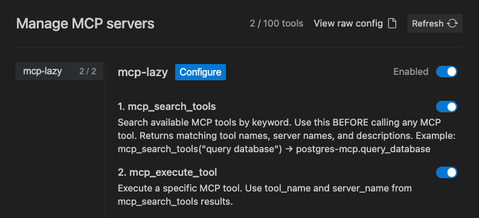

<pre>
███╗   ███╗ ██████╗██████╗       ██╗      █████╗ ███████╗██╗   ██╗
████╗ ████║██╔════╝██╔══██╗      ██║     ██╔══██╗╚══███╔╝╚██╗ ██╔╝
██╔████╔██║██║     ██████╔╝█████╗██║     ███████║  ███╔╝  ╚████╔╝
██║╚██╔╝██║██║     ██╔═══╝ ╚════╝██║     ██╔══██║ ███╔╝    ╚██╔╝
██║ ╚═╝ ██║╚██████╗██║           ███████╗██║  ██║███████╗   ██║
╚═╝     ╚═╝ ╚═════╝╚═╝           ╚══════╝╚═╝  ╚═╝╚══════╝   ╚═╝
</pre>

# mcp-lazy 🫠

[한국어](./docs/README.ko.md)

> Reduce MCP context window token usage by 90%+ with lazy loading. One command setup.

- MCP servers load all tool definitions into the context window at startup — even before you use them. With 5-10 servers, this can consume 30-50% of your context window. **mcp-lazy** proxies all your MCP servers through a single lightweight proxy that loads tools on-demand.

<center>

<br>

`82 tools exposed at startup`


👇 `Just 2 with mcp-lazy`



</center>

<br>

## Quick Start

Pick one for your agent:

```bash
npx mcp-lazy add --cursor        # Cursor
npx mcp-lazy add --codex         # Codex
npx mcp-lazy add --antigravity   # Antigravity
npx mcp-lazy add --opencode      # Opencode
npx mcp-lazy add --all           # or all at once
```

Then pre-build the tool cache (recommended):

```bash
npx mcp-lazy init
```

- The `add` command reads your agent's existing MCP config, saves all server definitions to `~/.mcp-lazy/servers.json`, and replaces the agent config with only the mcp-lazy proxy entry.
- `init` pre-builds the tool cache so your first agent session starts instantly. Without it, the first session will be slightly slower while mcp-lazy discovers tools from all servers.

  > **Tip:** Installed a new MCP server? Just re-run `npx mcp-lazy add --<agent>` — no extra steps.

<br>

## How It Works

```
Without mcp-lazy:
  Agent → MCP Server A (50 tools) + Server B (30 tools) + Server C (20 tools)
        = 100 tools loaded at startup (~67,000 tokens)

With mcp-lazy:
  Agent → mcp-lazy proxy (2 tools only, ~350 tokens)
              ↓ on-demand
         Server A / B / C (loaded only when needed)
         URL servers (Notion, Slack, etc.) via mcp-remote bridge
```

The proxy exposes just 2 tools:

- **mcp_search_tools** — Search available tools by keyword
- **mcp_execute_tool** — Execute a tool (lazy-loads the server on first call)


<br>

## What `add` Does

- When you run `npx mcp-lazy add --<agent>`, it:

1. Reads your agent's existing MCP server config
2. Extracts all server definitions (stdio and URL-based)
3. Converts URL servers (OAuth-requiring services like Notion, Slack) to stdio commands using `npx mcp-remote <url>`
4. Saves everything to `~/.mcp-lazy/servers.json`
5. Replaces the agent config with only the mcp-lazy proxy entry

- The proxy reads from `~/.mcp-lazy/servers.json` at runtime — that's where all your server definitions live after setup.

<br>

## Supported Agents

| Agent       | Status                      |
| ----------- | --------------------------- |
| Cursor      | ✓ Supported                 |
| Opencode    | ✓ Supported                 |
| Antigravity | ✓ Supported                 |
| Codex       | ✓ Supported                 |
| Claude Code | Native support (not needed) |

<br>

## Commands

### `npx mcp-lazy add`

- Register the proxy with your agent:

  ```bash
  npx mcp-lazy add --cursor        # register with Cursor
  npx mcp-lazy add --antigravity   # register with Antigravity
  npx mcp-lazy add --all           # register with all agents
  ```

Options:

- `--cursor`, `--opencode`, `--antigravity`, `--codex` — target agent
- `--all` — register with all agents

<br>

### `npx mcp-lazy init`

Pre-build the tool cache by connecting to all registered servers:

```bash
$ npx mcp-lazy init

mcp-lazy init — building tool cache...

  ✓ github-mcp         15 tools   342ms
  ✓ postgres-mcp       12 tools   518ms
  ✗ slack-mcp          connection timeout
  ✓ filesystem          8 tools   120ms

Cache saved: 35 tools from 3/4 servers in 1.2s
Ready! mcp-lazy serve will start instantly.
```

- Connects to every server in parallel and saves the tool index to `~/.mcp-lazy/tool-cache.json`
- Run this after `add` so the first agent session starts instantly instead of waiting for discovery

<br>

### `npx mcp-lazy doctor`

Diagnose your setup:

```bash
$ npx mcp-lazy doctor

✓ Node.js 18+ installed
✓ 7 MCP server(s) registered
  - github, notion, slack, postgres, filesystem, memory, puppeteer
✓ Cursor: registered

Token savings: 67,300 → 350 (99.5% reduction)
```

<br>

## URL & OAuth Support

- Some MCP servers are hosted at a URL and require OAuth (Notion, Slack, Linear, etc.). The `add` command automatically handles these by converting them to stdio commands using `npx mcp-remote`:

  ```
  URL server: https://mcp.notion.com/sse
            ↓ converted automatically
  stdio:    npx mcp-remote https://mcp.notion.com/sse
  ```

- This means all your servers — local stdio and remote OAuth-requiring URL servers — get proxied through mcp-lazy with no manual conversion needed.

<br>

## How Search Works

When an agent calls `mcp_search_tools("query database")`, the proxy searches across all registered tools using weighted scoring:

| Match Type                | Score |
| ------------------------- | ----- |
| Exact tool name match     | +1.0  |
| Partial tool name match   | +0.8  |
| Description keyword match | +0.6  |
| Server description match  | +0.4  |

Results are sorted by relevance and returned to the agent.

<br>

## FAQ

### Q: The first run is slow.

- On the very first launch, mcp-lazy connects to every registered MCP server to discover available tools and build the search index. This can take 10-30 seconds depending on the number of servers.
- After that, the tool index is cached at `~/.mcp-lazy/tool-cache.json`. Subsequent launches load from cache and start in under a second.
- The cache is automatically refreshed when your server configuration changes.
- Run `npx mcp-lazy init` after setup to pre-build the cache and avoid the slow first start.

### Q: I'm getting "Error: Unexpected error" during setup.

- Check that you have read/write permissions for the config directory. For example:

  > Cursor: `~/.cursor/mcp.json` <br>
  > Codex: `~/.codex/config.toml` <br>
  > Opencode: `~/.config/opencode/config.json` <br>
  > Antigravity: `~/.gemini/antigravity/mcp_config.json`

- Try running `ls -la` on the relevant path to verify permissions. If needed, fix with `chmod 644 <path>`.

### Q: I installed a new MCP server after setting up mcp-lazy. How do I add it?

- Simply add the new server to your agent's MCP config as usual, then re-run the add command:

  ```bash
  npx mcp-lazy add --cursor    # re-scans and picks up the new server
  ```

- mcp-lazy will detect the new server, add it to `~/.mcp-lazy/servers.json`, and keep the proxy config intact.

<br>

## Scope

- mcp-lazy currently supports **global MCP configurations only** (e.g., `~/.cursor/mcp.json`). Project-level MCP configs (e.g., `.cursor/mcp.json` in a project root) are not yet supported.

<br>

## Requirements

- Node.js 18+
- Existing MCP server configurations (global scope)

## License

MIT
